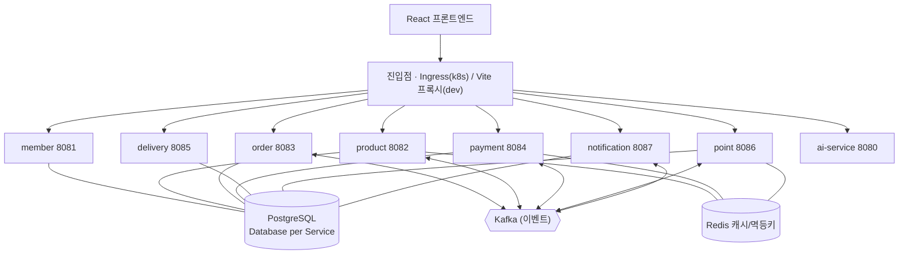
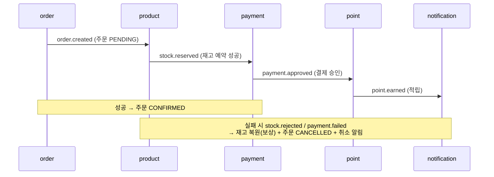

# ai-commerce-platform

> 일반 상품 커머스를 **이벤트 드리븐 MSA**로 구축하고 **AI(RAG/Agent)** 기능을 더한 커머스 플랫폼.
> Spring Boot 3.5 / Java 21 백엔드 8개 서비스 + React 프론트엔드, Kafka 기반 Saga, 쿠버네티스 배포.

## 아키텍처



관측성은 Prometheus(각 서비스 `/actuator/prometheus` 수집) + Grafana. 배포는 로컬 k8s 매니페스트(`infra/k8s/`), CI/CD는 GitHub Actions.

## 주문 처리 흐름 (Choreography Saga)

주문은 여러 서비스에 걸친 트랜잭션이라, 이벤트 연쇄 + 실패 시 보상으로 최종 일관성을 맞춘다.



## 서비스

| 서비스 | 역할 | 포트 | DB |
|--------|------|------|-----|
| member | 회원 · 인증(JWT) | 8081 | member_db |
| product | 상품 카탈로그 · 재고 · 검색 | 8082 | product_db |
| order | 장바구니 · 주문(Saga 시작) | 8083 | order_db |
| payment | 결제 | 8084 | payment_db |
| delivery | 배송 추적 | 8085 | delivery_db |
| point | 포인트 적립 | 8086 | point_db |
| notification | 알림 발송 | 8087 | notification_db |
| ai-service | 상품추천 RAG · 쇼핑 Agent | 8080 | — |

## 기술 스택

Java 21 · Spring Boot 3.5 · PostgreSQL · Redis · Apache Kafka · Docker ·
Kubernetes · Ingress-NGINX · Prometheus · Grafana · GitHub Actions ·
React 19 · TypeScript · Tailwind CSS · AI(RAG/Agent)

## 디렉터리

| 경로 | 내용 |
|---|---|
| `services/` | 8개 마이크로서비스 |
| `frontend/` | React 쇼핑 UI (nginx 컨테이너) |
| `infra/` | docker-compose(로컬) · k8s 매니페스트 · 모니터링 |
| `docs/adr/` | 아키텍처 결정 기록(ADR) |
| `docs/troubleshooting.md` | 트러블슈팅 기록 |
| `.github/workflows/` | CI/CD (테스트 · 이미지 빌드/push) |

## 실행

### A. 로컬 개발 (docker-compose + Gradle)

```powershell
# 1) 인프라 (postgres/redis/kafka, 127.0.0.1 바인딩)
cd infra
docker compose -f docker-compose.yml up -d

# 2) 각 서비스 (별도 터미널)
cd services/<service>
./gradlew bootRun

# 3) 프론트
cd frontend
npm install && npm run dev     # http://localhost:5173
```

### B. 쿠버네티스 (로컬 클러스터)

```powershell
# 이미지 빌드
docker build -t ai-commerce/<service>:latest ./services/<service>
docker build -t ai-commerce/frontend:latest ./frontend

# 배포
kubectl apply -f infra/k8s/

# Ingress 컨트롤러(최초 1회)
kubectl apply -f https://raw.githubusercontent.com/kubernetes/ingress-nginx/controller-v1.11.3/deploy/static/provider/cloud/deploy.yaml

# 접속: http://localhost  (/ → 프론트, /api/* → 서비스)
# 정리: kubectl delete ns ai-commerce monitoring
```

## 모니터링

```powershell
kubectl port-forward -n monitoring svc/grafana 3000:3000     # http://localhost:3000 (admin/admin)
kubectl port-forward -n monitoring svc/prometheus 9090:9090  # http://localhost:9090
```

Grafana에서 대시보드 `4701`(JVM Micrometer) import → 서비스별 JVM/HTTP 지표.

## 테스트

각 서비스는 H2(PostgreSQL 호환 모드) 기반 통합 테스트를 가진다. 브로커 없이 그린 유지.

```powershell
cd services/<service>
./gradlew test
```

## 문서

- [아키텍처 결정 기록(ADR)](docs/adr/)
- [트러블슈팅 기록](docs/troubleshooting.md)

## 로드맵 (6 Phase)

- [x] **Phase 1** — 개발환경 · GitHub 저장소 · 기본 아키텍처 · MSA 골격
- [x] **Phase 2** — 회원·상품·주문·결제·배송 서비스 + PostgreSQL
- [x] **Phase 3** — Redis · Kafka · Docker
- [x] **Phase 3.5** — React 프론트엔드
- [x] **Phase 4** — AI 서비스(RAG/Agent)
- [x] **Phase 4.5** — 포인트·알림 서비스 + Kafka 이벤트 체인 + 재고 Saga(보상 트랜잭션)
- [x] **Phase 5** — Kubernetes · 모니터링(Prometheus/Grafana) · GitHub Actions CI/CD
- [ ] **Phase 6** — 성능 테스트 · 트러블슈팅 문서화 · 문서 정리 ← **진행 중**

## 요구 환경

- JDK 21 · Git · Node.js 24
- Docker Desktop + WSL2 (Kubernetes 포함)
- (옵션) `ANTHROPIC_API_KEY` — ai-service의 API 백엔드 사용 시
